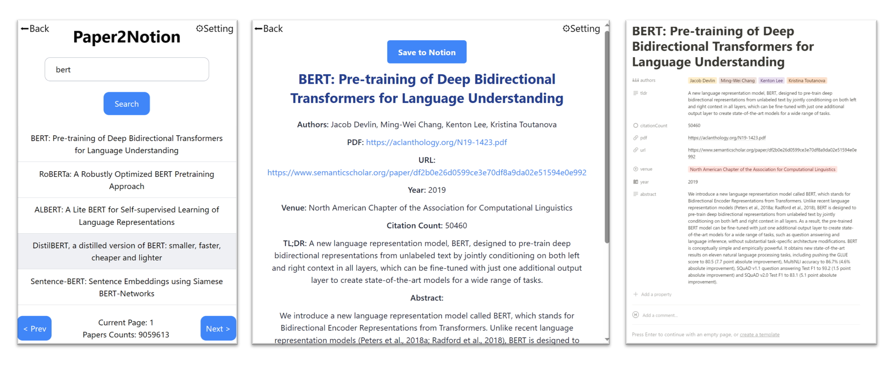

# Paper2Notion

一个chrome浏览器插件，基于[Semantic Scholar API](https://www.semanticscholar.org/product/api)，可以将论文信息导入到notion database。

目前支持：

- 简单的论文搜索
- 论文信息的查看
- 保存论文信息到notion

## 安装

- 在[releases](https://github.com/xiahaoyun/paper2notion/releases)中下载最新的“paper2notion.zip”并解压
- 在浏览器的地址栏中输入下面的链接进入拓展管理：
  - chrome：chrome://extensions/
  - edge：edge://extensions/
- 在右上角，开启开发者模式
- 点击“加载已解压的扩展程序”
- 选择所解压的文件夹（有manifest.json的文件夹）

## 配置

### 1.notion token

- 打开[My integrations | Notion Developers](https://www.notion.so/my-integrations)，创建一个Integration 并获取到token

### 2.database

- 创建database
  - 打开下面这个database点击duplicate（创建副本）。
  - [paper2notion_template](https://xiahaoyun.notion.site/88c90ed6047f466abafc37e34add44b4?v=d323c305537c49469fc0856d62a4da04)  
- 添加Integration
  - 点击notion右上角的三个点按钮→connections→add connection，选取刚才创建的Integration。

### 3.填写配置

最后点击插件右上角“Setting”填写“Notion Token”和“Database URL”并保存

## TODO

- 增加从arxiv页面直接保存
- 增加基于ChatGPT的论文属性生成：如基于摘要生成关键词 